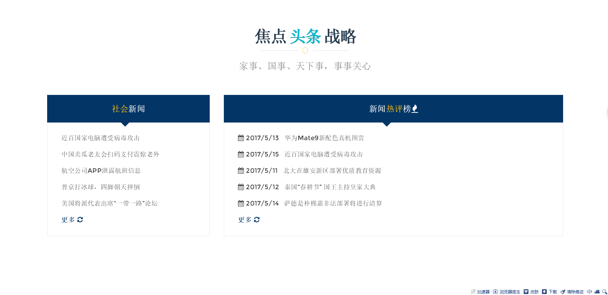
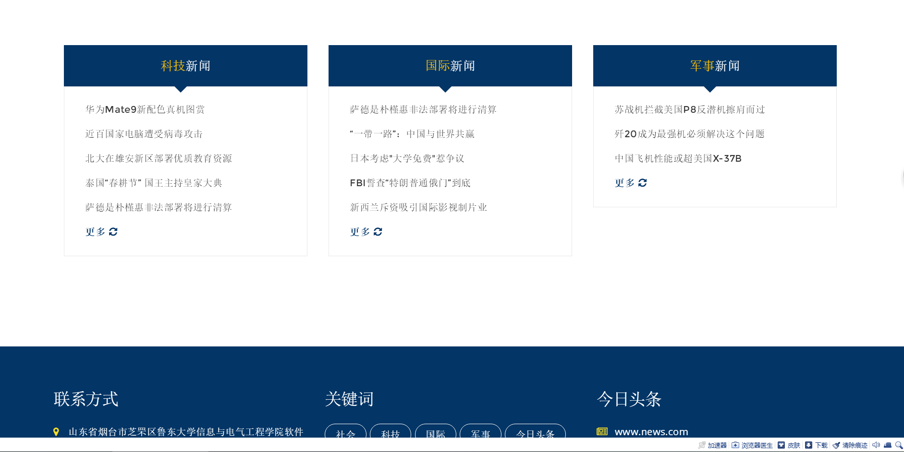
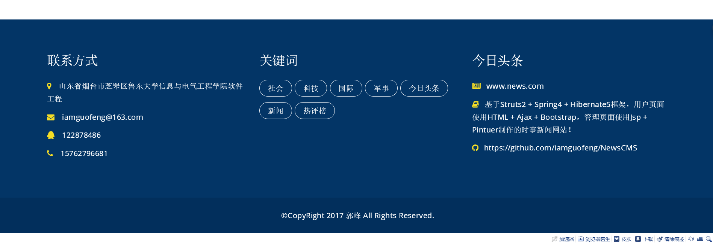
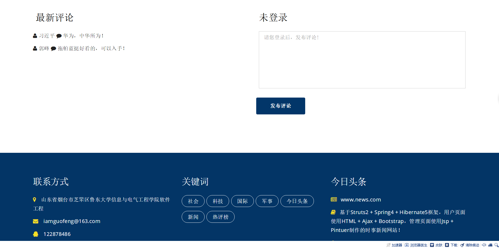
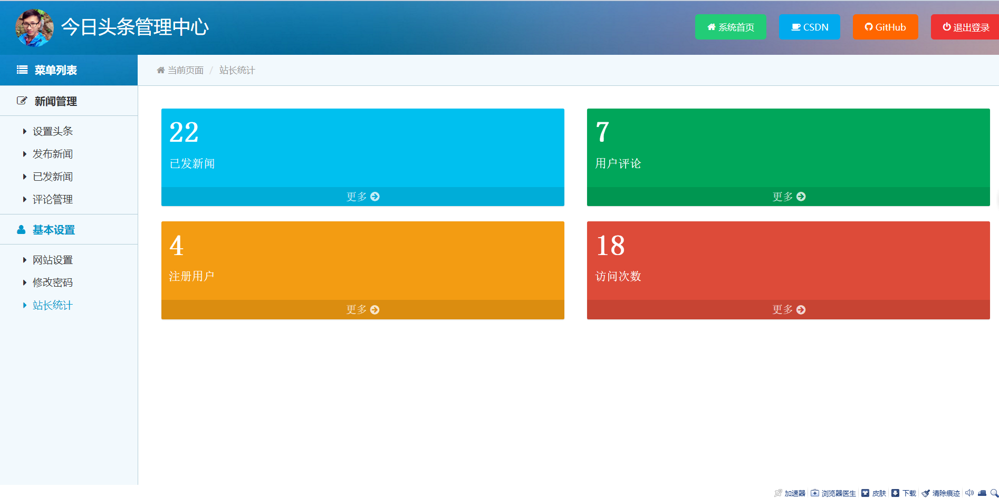
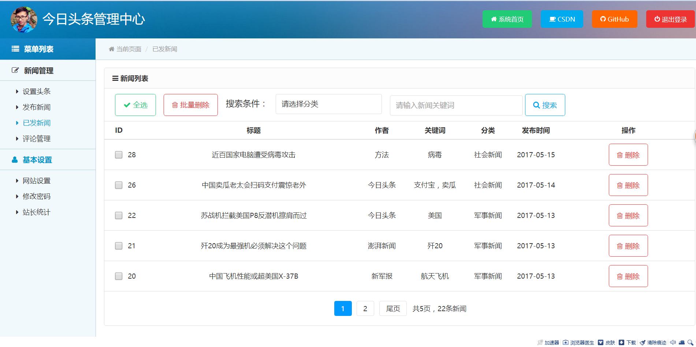

Project Description
-------
* Theme：The news system based on the SSH framework. The front page uses the BootStrap framework and uses Ajax to refresh the news content locally. The backstage page uses the Pintuer framework and uses the MySQL database.
* Front desk function：Login system and registered account, read big picture headline news, read classified news, read news details, comment news content.
* Background functions: login administrator role, modify password, webmaster statistical information, set website footer, publish news, set up headline news, manage news and management reviews.
* Support：If you have a problem or find an application error, you can submit a question here or contact me by mail. If you think this application is good, I hope you will give a "Star" to the project.
* 请联系我：需要本项目的答辩PPT、文档（非PDF）、数据库文件、用例图、新闻模拟内容请发邮件联系我！

Contact Information
-------
* Author: 郭峰
* Email: iamguofeng@163.com 
* CSDN: http://blog.csdn.net/plain_maple

Application Screenshot
-------
| Today's headline               | 
|:------------------------------:|
|              | 

| Lively news list               | 
|:------------------------------:|
|              | 

| Classified news                | 
|:------------------------------:|
|              | 

| Footer information             | 
|:------------------------------:|
|              | 

| News detail                    | 
|:------------------------------:|
|              | 

| Review area                    | 
|:------------------------------:|
|              | 

| Stationmaster statistics       | 
|:------------------------------:|
|              | 

| News management                | 
|:------------------------------:|
|              | 

